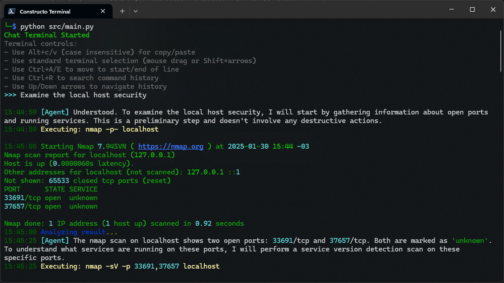

# Constructo

Constructo is an AI-powered pentesting and security agent designed to assist with executing commands, analyzing logs, and making autonomous decisions based on the analysis. It is built to work with Linux/Kali commands and provides a detailed log of all actions.

### Example


## Features

- Execute Linux/Kali commands
- Analyze logs and outputs
- Make decisions based on analyses
- Request confirmation for critical actions
- Rate limiting and retry logic for API calls
- Deep reasoning for complex analysis

## Use Cases

Constructo can be effectively used in various security and automation scenarios, including:

### Security Analysis
- Basic security assessments and vulnerability scanning
- Local machine security analysis (file permissions, open ports, etc.)
- Network security analysis
- Log analysis

### Automation Tasks
- Bulk domain analysis and filtering
- Web scraping
- Automated report generation
- Repetitive task automation in security workflows

### Code Analysis
- Source code security review
- Pattern detection in codebases
- Static code analysis for vulnerabilities
- Code quality assessment

### Research and Reconnaissance
- Information gathering for penetration testing
- OSINT (Open Source Intelligence) collection
- Security research data processing
- Threat intelligence analysis


## Prerequisites

- A Linux-based system.
- Python 3.7+
- An Google Generative AI API key.
  - You can request access to the API [here](https://aistudio.google.com).

## Configuration

Constructo uses a configuration file (`config.yaml`) to manage settings. Below is an example configuration:

```yaml
api_key: "YOUR_API_KEY_HERE"
model:
  name: "gemini-2.0-flash-exp"
  max_output_tokens: 4096
  temperature: 0.7
  top_p: 0.9
  top_k: 40

deep_reasoning:
  debug_mode: false  # When true, activate deep reasoning in all requests
  perspectives:
    conservative:
      temperature: 0.3
      top_p: 0.5
    balanced:
      temperature: 0.5
      top_p: 0.7
    creative:
      temperature: 0.8
      top_p: 0.9
  activation_triggers:
    consecutive_failures: 4
    high_risk_commands: true

agent:
  language: "english" # Language of the agent responses
  require_confirmation: true  # Recommended for safety
  risk_threshold: "medium"   # "none", "low", "medium", "high" - only ask for risks above this level

api:
  rate_limit:
    requests_per_minute: 4  # Maximum requests per minute
    delay_between_requests: 10  # Delay in seconds between requests
  retry:
    max_attempts: 5  # Maximum number of retry attempts
    delay_between_retries: 20  # Delay in seconds between retries
```

## Installation and Execution

### 1. Clone the latest release
```bash
git clone --branch latest https://github.com/constructo/constructo.git
cd constructo
```

### 2. Install dependencies
```bash
pip install -r requirements.txt
```

### 3. Configure the API key
Edit the `config.yaml` file and add your API key:
```yaml
api_key: "YOUR_API_KEY_HERE"
```

### 4. Run Constructo
```bash
python -m constructo
```
or

```bash
python src/main.py
```

## Deep Reasoning
### Video Demonstration
https://github.com/user-attachments/assets/d8d58cc6-4d63-408d-ad13-57c03a0f9ec8


The deep reasoning module provides multi-perspective analysis of complex situations. It analyzes problems from different viewpoints (conservative, balanced, creative) and synthesizes the results into actionable insights. The module is automatically activated when:

- High risk commands are detected
- Complex situations require deeper analysis
- Multiple consecutive failures occur
- Explicitly requested by the main agent

## Disclaimer

**Important:** Constructo is an experimental project intended for educational and professional use in authorized environments only. The developers are not responsible for any damages or misuse of this software. By using this software, you agree to the following:

1. Use only in environments where you have explicit permission
2. Avoid running as root user unless absolutely necessary
3. Keep `require_confirmation` enabled for critical operations
4. Understand that this is experimental software and may contain bugs
5. Use at your own risk

## Known Issues

- **Rate Limiting During Deep Reasoning:** When rate limiting is triggered during deep reasoning analysis, it may cause errors or infinite loops. Workaround: Increase rate limit thresholds or reduce analysis complexity.
- **Command Output Handling:** Some commands may not have their output properly captured.

## Development Status

**Warning:** This project is still in active development and may contain bugs or incomplete features. Key considerations:

- Always use in controlled environments
- Keep `require_confirmation` enabled
- Avoid running as root user
- Monitor system behavior closely
- Report any issues encountered

### Completed Features
- [x] Basic chat functionality
- [x] Execution of common Linux/Kali commands
- [x] Log analysis and decision making
- [x] Request confirmation for critical actions
- [x] Rate limiting and retry logic for API calls
- [x] Deep reasoning module

### Upcoming Features
- [ ] Support for interactive tools (e.g., msfconsole, sqlmap)
- [ ] Persistent memory and learning system
- [ ] Support for additional AI APIs
- [ ] Access to internet search

## Contributing

Contributions are welcome! Please fork the repository and submit a pull request with your changes.

## License

This project is licensed under the MIT License. See the [LICENSE](LICENSE) file for details.
